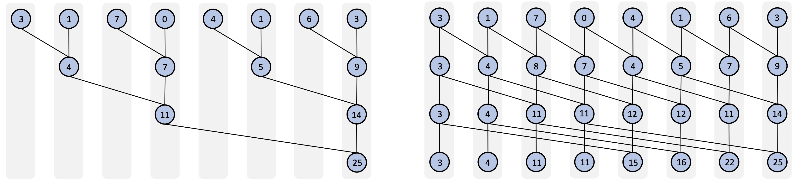

```{r setup, include=FALSE}
knitr::opts_chunk$set(echo = TRUE, warning = FALSE)
options(width = 120)
```

```{r}
sessionInfo()
```

## General-purpose computing on GPU (GPGPU)

GPGPU is the use of a graphics processing unit (GPU), which typically handles computation only for computer graphics, to perform computation in applications traditionally handled by the CPU.

GPGPU is fundamentally a software concept, not a hardware concept; it is a type of algorithm, not a piece of equipment.

GPUs are often conveniently available on standard laptoops and desktop computers and can be externally connected to a personal computer.


### GPU architecture and memory hierarchy

<center>{width=80%}</center>

GPU consists of multiprocessor element that run under the shared-memory threads model. 
GPUs can run hundreds or thousands of threads in parallel.

- Local memory
    - Each thread has private local memory. 

- Shared memory
    - Each thread block has shared memory visible to all threads of the block. 

- Global memory
    - All threads have access to the same global memory. 

<center>{width=60%}</center>


### GPGPU platform

- CUDA
    - CUDA is a software development kit (SDK) and application programming interface (API) that allows using the programming language C/C++ to code algorithms for execution on NVIDIA GPUs. 
    - There are extensive CUDA libraries for scientific computing: CUB, Thrust, CuBLAS, CuRAND, CuSparse, ...

- OpenCL
    - OpenCL is an open-source GPGPU framework that can execute programs on GPUs from many manufacturers including Nvidia and AMD, but lacks some libraries essential for statistical computing.


### Heterogeneous programming

- Basic concepts
    - Host: The CPU and its memory (host memory)
    - Device: The GPU and its memory (device memory)
    - Kernel: Parallel code that launched and executed on a device by many threads, as opposed to only one like regular **function**

- Workflow
    - Write code for the device (kernel)
    - Write code for the host to launch the kernel
    - Pass runtime and algorithmic parameters and launch the kernel
    - Manage memory transactions between host and device

<center>{width=40%}</center>


## GPGPU in R

- Use existing R GPU packages from CRAN (check https://cran.r-project.org/web/views/HighPerformanceComputing.html)
    - The [OpenCL package](https://cran.r-project.org/web/packages/OpenCL/index.html)

- Access the GPU through CUDA/OpenCL-accelerated programming launguages such as C/C++
    - Be able to flexibly benefit from many GPU-accelerated libraries (from NVIDIA or other open-source libraries).
    - Use the GPU through heterogeneous programming with CUDA/OpenCL directly.
    - Need to build an interface through C/C++ to bridge R and CUDA/OpenCL.

### Examples

```{r}
n = 10^6
x1 = rnorm(n)
x2 = rnorm(n)
```

#### Add two vectors

```{r}
add_r <- function(x1, x2) {
  out <- rep(length(x1), 0.0)
  for (i in 1:length(x1)) {
    out[i] <- x1[i] + x2[i]
  }
  return(out)
}
add_r
```

```{r}
library(compiler)
add_rc <- cmpfun(add_r)
```

```{r}
library(Rcpp)
cppFunction('NumericVector add_c(NumericVector x1, NumericVector x2) {
  int n = x1.size();
  NumericVector out (n);
  for(int i = 0; i < n; i++) {
    out[i] = x1[i] + x2[i];
  }
  return out;
}')
add_c
```

```{r}
library(OpenCL)
platform <- oclPlatforms()[[1]] # retrieve available OpenCL platforms
device <- oclDevices(platform)[[2]] # get OpenCL devices for the given platform
ctx <- oclContext(device) # create an OpenCL context for a given device
platform
device
ctx
```


```{r}
# define kernel
code <- c("
   #pragma OPENCL EXTENSION cl_khr_fp64 : enable
   __kernel void kernel_add(
     __global float* output,
     const int n,
     __global const float* input1,
     __global const float* input2
   )
   {
      int i = get_global_id(0);
      if (i<n) output[i] = input1[i] + input2[i];
   };
")

# create and compile OpenCL kernel code
kernel_add <- oclSimpleKernel(ctx, "kernel_add", code, "single")

# create OpenCL buffer on GPU
d_x1<-clBuffer(ctx, length(x1), "single")
d_x2<-clBuffer(ctx, length(x2), "single")

# copy data from host (CPU) to device (GPU)
add_gpu_copy <- function(d_x, h_x) {
  d_x[] <- h_x
}
add_gpu_copy(d_x1, x1)
add_gpu_copy(d_x2, x2)

# run add kernel using OpenCL
add_gpu <- function(d_x1, d_x2) {
  result <- oclRun(kernel_add, length(d_x1), d_x1, d_x2)
  return(result)
}
```


```{r}
library(microbenchmark)
microbenchmark(add_r(x1, x2), add_rc(x1, x2), add_c(x1, x2), x1+x2,
               add_gpu(d_x1, d_x2), add_gpu_copy(d_x1, x1))
```

#### Tree-based parallel algorithms

##### Reduction

Reductions convert an array of elements into a single result:

$$[a_0, a_1, ..., a_{n-1}] \rightarrow\sum_{i=0}^{n-1} a_i.$$

Reductions are useful for implementing log-likelihood calculations, since independent samples contribute additively to the model log-likelihood.

##### Scan

Scans take an array and return an array:

$$[a_0, a_1, ..., a_{n-1}] \rightarrow [a_0, a_0 + a_1, ..., \sum_{i=0}^{n-1} a_i].$$

<center>{width=90%}</center>

##### Use CUDA/Opencl libraries

- CUB library: <https://nvlabs.github.io/cub/index.html>


## Tips of using GPGPU in statistical computing

- Parallelization using GPUs generally perform better on very large sample size. When work on problems with small sample size, the communication latency costs often overpower the gains from the parallelized work.

- When optimize an existing program, start with off-loading the most computationally intensive routines to the GPU before rewriting the whole codebase.

- Apply GPU-accelerated libraries to gain instant speed-up. We often don't need to write complicated algorithms by ourselves.


## Learning resources

- Introduction to Parallel Computing Tutorial: <https://hpc.llnl.gov/documentation/tutorials/introduction-parallel-computing-tutorial>

- Accelerate R Applications with CUDA: <https://developer.nvidia.com/blog/accelerate-r-applications-cuda/>

- CUDA C++ Programming Guide: <https://docs.nvidia.com/cuda/cuda-c-programming-guide/index.html>

- CUDA GPU-Accelerated libraries: <https://developer.nvidia.com/gpu-accelerated-libraries>
